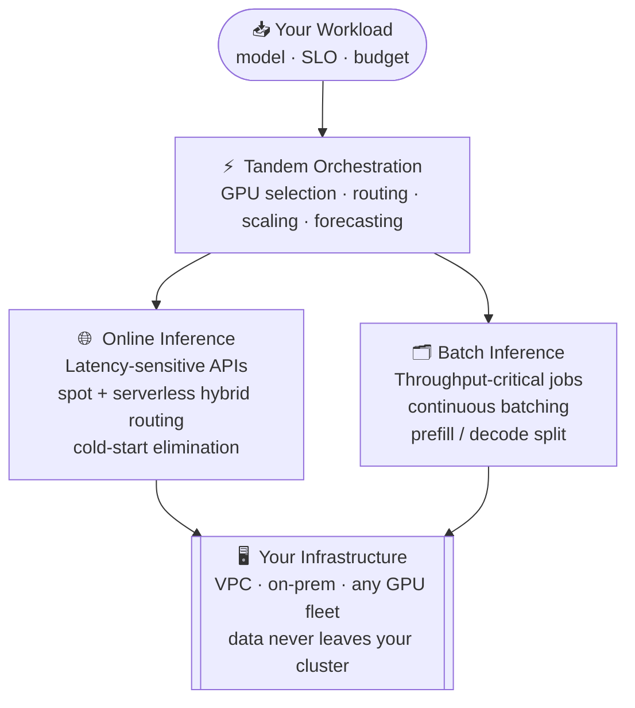

<div align="center">

# TANDEM

### The Inference Optimization Platform

*Maximum performance. Minimum cost. Your hardware.*

[](https://tandemn.com)
[](https://github.com/Tandemn-Labs/Tandemn-docs)
[](https://tandemn.com/contact.html)
[](https://tandemn.com/contact.html)

</div>

---

Running AI on your own hardware shouldn't mean cold starts, idle GPUs, and endless MLOps complexity. **Tandem** is the orchestration layer that manages your infrastructure for cost and throughput — you specify the model and your SLO, it handles everything else.

```
tandem deploy --model llama-70b --task online --slo p99=200ms

  ✦ Scanning cluster...         found 12x A100-80GB, 4x H100-80GB
  ✦ Selecting optimal GPUs...   4x A100-80GB  (cost-optimized for workload)
  ✦ Routing strategy...         hybrid spot + serverless
  ✦ Launching replicas...       3x provisioned, 1x warm standby
  ✦ SLO forecast...             p99 = 147ms  ✓  (target: 200ms)

  ● Endpoint live  →  https://your-vpc/v1/chat/completions
  ● Estimated cost  $0.65 / hr   (vs $3.25 on-demand always-on)
  ● Savings         80%  ↓
```

---

## The Problem

GPU infrastructure is broken for AI teams in three compounding ways.

**Cold starts eat your latency budget.**
Always-on deployments cost a fortune just to stay warm. Serverless has 3–4 minute cold starts. You're forced to choose between paying for idle capacity or watching your p99s spike.

**Traffic spikes punish everyone.**
Autoscaling takes minutes. Queues back up. You either overprovision 3× to absorb spikes or accept SLO violations. Neither is acceptable in production.

**GPUs sit idle while you pay full price.**
Poor batching, uncoordinated scheduling, and unbalanced fleets mean average GPU utilization hovers around 20–30%. You're paying for four GPUs and using one.

Tandem eliminates all three — not with workarounds, but by rethinking the entire orchestration layer.

---

## What Tandem Does



**Deploy once. Tandem handles the rest.**

When you submit a workload, Tandem scans your VPC quota and on-prem availability, selects the optimal GPU configuration, routes traffic to the right execution strategy, forecasts whether your SLO will be met, and rebalances resources in real time if conditions change. There is no step two.

---

## Online Inference Optimization

For latency-sensitive production APIs, Tandem uses a hybrid spot + serverless strategy that delivers spot economics without spot reliability risk.

The core insight: spot GPUs are **67–80% cheaper** than on-demand, but they're slow to provision and can be interrupted. Most teams avoid them because the operational complexity isn't worth the savings. Tandem makes that complexity disappear.

```
Traffic pattern →  Tandem routing decision

  Baseline traffic    →  spot instances (cheapest available)
  Traffic spike       →  overflow to serverless (instant capacity)
  Spot preemption     →  automatic failover, zero dropped requests
  Traffic drops       →  scale down spot, release capacity
```

**Works with your existing stack.** Integrates with Modal, RunPod, and Cloud Run for serverless; uses AWS via SkyPilot for spot capacity. Bring your own accounts — Tandem is the routing layer, not the cloud.

**Full cost transparency.** Real-time spend tracking, routing split percentages, savings vs. baseline, and per-component cost breakdowns. You always know exactly what you're paying and why.

---

## Batch Inference Optimization

For throughput-critical workloads — large-scale evals, data pipelines, offline scoring — the cost driver is GPU utilization, not cold starts. Tandem maximizes utilization through a combination of:

**Continuous batching** — new requests are added to in-flight batches dynamically, eliminating the throughput waste of waiting for batch boundaries. GPU stays busy at every moment.

**Prefill / decode splitting** — prefill is compute-bound; decode is memory-bound. Assigning them to different GPU types extracts maximum efficiency from heterogeneous fleets.

**KV cache optimization** — intelligent cache management reduces redundant computation across similar prompts, meaningfully improving throughput on real-world workloads.

**SLO forecasting** — Tandem continuously models whether your deadline will be met and proactively scales before it's at risk. No more submitting a job and hoping it finishes in time.

```
Batch job submitted:  10,000 prompts · Llama-70B · deadline: 2 hours

  t=0:00   GPU selection...     4x A100-80GB  selected
  t=0:00   Batch started        continuous batching · KV cache active
  t=0:45   SLO forecast...      2h 45m predicted  ⚠️  (target: 2h)
  t=0:45   Scaling action...    +2 GPUs provisioned automatically
  t=0:50   SLO forecast...      1h 48m predicted  ✓
  t=1:52   Batch complete       10,000 / 10,000 prompts  ✓
```

---

## Heterogeneous GPU Support

Most inference platforms assume a homogeneous cluster. Real infrastructure isn't like that.

Tandem unifies mixed hardware — A100s, H100s, MI300X, L40S — into a single cohesive runtime. It abstracts away the heterogeneity: you describe your workload requirements, and Tandem figures out which GPUs to use, how to shard the model across them, and how to rebalance if one class of hardware is saturated.

This matters especially for research platforms and on-prem deployments where cluster composition is rarely uniform.

---

## Your Infrastructure. Your Data.

Tandem installs in your VPC or on-prem environment. Your model weights, your prompts, and your completions never leave your infrastructure. There is no data plane in Tandem's cloud.

The orchestration intelligence runs as a lightweight control plane that connects to your engines via API key. For teams that require full air-gap deployment, self-hosted orchestration is available under the Enterprise plan.

```
┌─────────────────────────────────────────────────────┐
│                   Your VPC / On-Prem                │
│                                                     │
│   ┌─────────────┐      ┌──────────────────────┐    │
│   │   Tandem    │─────▶│   Your GPU Fleet     │    │
│   │  (control)  │      │  A100 · H100 · MI300 │    │
│   └─────────────┘      └──────────────────────┘    │
│          │                                          │
│          ▼                                          │
│   ┌─────────────┐                                   │
│   │  Your Data  │   ← never leaves this boundary   │
│   └─────────────┘                                   │
└─────────────────────────────────────────────────────┘
```

---

## Open Source

The inference engines that power Tandem are fully open source. No black boxes, no vendor lock-in, no trust-me-bro benchmarks.

| Repository | Description | Language |
|---|---|---|
| [**tandemn-vllm**](https://github.com/Tandemn-Labs/tandemn-vllm) | Heterogeneous inference engine — run models across mixed GPU fleets | Python |
| [**tandemn-tuna**](https://github.com/Tandemn-Labs/tandemn-tuna) | Hybrid spot + serverless router for cost-optimized online inference | Python |
| [**tensor-iroh**](https://github.com/Tandemn-Labs/tensor-iroh) | P2P tensor transport layer (Tandemn × Iroh) | Rust |
| [**Tandemn-docs**](https://github.com/Tandemn-Labs/Tandemn-docs) | Full documentation | MDX |

Contributions welcome. If you're working on distributed inference, GPU scheduling, or systems-level ML infrastructure — open an issue or reach out directly.

---

## Use Cases

<details>
<summary><b>🚀 &nbsp; AI Product Teams</b></summary>
<br>

Production APIs with spiky, unpredictable traffic patterns. You can't afford 4-minute cold starts, but you also can't justify paying for 10 always-on GPUs to handle a 5-minute traffic burst every few hours.

Tandem keeps endpoints responsive by routing baseline traffic to cheap spot capacity and overflowing to serverless only when needed. You get spot economics with serverless reliability, automatically, with no manual configuration.

</details>

<details>
<summary><b>🗂️ &nbsp; Large-Scale Batch Jobs</b></summary>
<br>

Offline evaluations, dataset scoring, synthetic data generation, or any workload where you have a large number of prompts and a deadline. The challenge isn't latency — it's cost and predictability.

Tandem selects optimal GPUs, forecasts completion time before the job starts, and scales proactively if the forecast drifts. You know what the job will cost and when it will finish before you submit it.

</details>

<details>
<summary><b>🔬 &nbsp; Research Platforms</b></summary>
<br>

University clusters, national labs, and research teams often have heterogeneous, messy hardware — a mix of GPU generations and vendors accumulated over years of grants and procurement cycles.

Tandem abstracts this into a unified runtime. A100s, H100s, and MI300X all work together. Researchers submit workloads without needing to know which GPUs are available or how to configure tensor parallelism for each.

</details>

<details>
<summary><b>🏭 &nbsp; Enterprise On-Prem Deployments</b></summary>
<br>

Regulated industries — finance, healthcare, government — often can't use public cloud inference APIs. On-prem GPU deployments are the requirement, not a preference.

Tandem is designed for this: full VPC and on-prem support, data that never leaves your infrastructure, air-gap deployment options, and SLA support under the Enterprise tier.

</details>

---

## What We Believe

**Open source first.** Infrastructure should be inspectable, forkable, and community-driven. Core engines are fully open source with transparent benchmarks. If you're trusting us with your inference stack, you should be able to read every line of code that touches your workloads.

**Transparent by default.** Public roadmaps, public benchmarks, audit-ready code. We don't ship demo numbers — every performance claim is reproducible.

**Built for the messy real world.** We don't test on pristine clusters with synthetic workloads. Spot preemptions, heterogeneous GPUs, traffic spikes, SLO deadlines — this is what we optimize for.

**Teams shouldn't become infrastructure experts.** The goal is to make GPU infrastructure invisible. You describe what you need: model, latency target, budget. The system figures out the rest.

---

## The Team

<table>
<tr>
<td><b>Mankeerat</b> — Co-Founder / CEO</td>
<td><a href="https://www.linkedin.com/in/mankeerat-sidhu">LinkedIn</a> &nbsp;·&nbsp; <a href="https://mankeerat.github.io/">Website</a></td>
</tr>
<tr>
<td><b>Hetarth</b> — Co-Founder / CTO</td>
<td><a href="https://www.linkedin.com/in/hetarth-chopra/">LinkedIn</a> &nbsp;·&nbsp; <a href="https://calendly.com/hetarth/30min">Book a call</a></td>
</tr>
<tr>
<td><b>Gangmuk</b> — Research MLSys Engineer</td>
<td><a href="https://www.linkedin.com/in/gangmuk">LinkedIn</a> &nbsp;·&nbsp; <a href="https://gangmuk.github.io/">Website</a></td>
</tr>
<tr>
<td><b>Quan</b> — Founding Engineer</td>
<td><a href="https://www.linkedin.com/in/orangerouter">LinkedIn</a> &nbsp;·&nbsp; <a href="https://orangerout.ing/">Website</a></td>
</tr>
<tr>
<td><b>Max</b> — Forward Deployed Engineer</td>
<td><a href="[https://www.linkedin.com/in/maxeisenberg/](https://www.linkedin.com/in/maxeisenberg/)">LinkedIn</a></td>
</tr>
</table>

We're based in San Francisco and actively hiring for distributed systems and ML infrastructure roles. If you're excited about inference optimization at the systems level — [reach out](https://tandemn.com/contact.html).

---

## Pricing

| | Open Source | Managed Orchestration | Enterprise |
|---|:---:|:---:|:---:|
| Inference engines | ✓ | ✓ | ✓ |
| Self-hosted | ✓ | ✓ | ✓ |
| Intelligent GPU selection | — | ✓ | ✓ |
| SLO forecasting | — | ✓ | ✓ |
| Cluster management dashboard | — | ✓ | ✓ |
| Additional savings vs. engine-only | — | +20–40% | maximum |
| Private deployment | — | — | ✓ |
| SLA support | — | — | ✓ |
| Dedicated engineering | — | — | ✓ |
| **Status** | Coming Soon | Coming Soon | Contact us |

---

<div align="center">

**Interested in what we're building?**

Whether you want to contribute, run Tandem on your infrastructure, or just talk distributed inference — we'd love to hear from you.

[**tandemn.com**](https://tandemn.com) &nbsp;·&nbsp; [**GitHub**](https://github.com/Tandemn-Labs) &nbsp;·&nbsp; [**Contact**](https://tandemn.com/contact.html) &nbsp;·&nbsp; [**Join Waitlist**](https://tandemn.com/contact.html)

</div>
